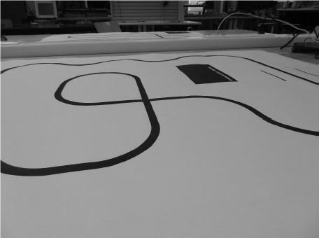

# LineFollower

lege repository die je als template kan gebruiken om een eigen repository te starten voor uw linefollower project

  
## specifications

microcontroller: Arduino Leonardo

motors: 6V, 50:1 (300/min)

h-bridge: DRV8833

sensors: QTR-8A

batteries:2x 18650 batterijen

wireless communication: HC05

distance sensor - motors: 7.5cm

weight:

speed: 0.1477 m/s

